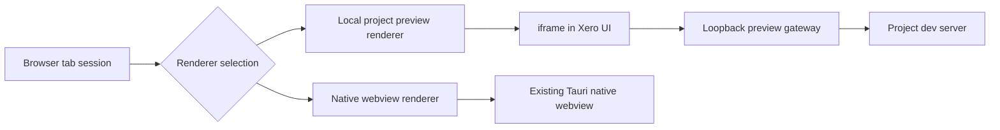

# Hybrid Browser Rendering Plan

Status: proposed

## Reader And Goal

This document is for the next engineer implementing the browser sidebar rendering change.
After reading it, they should be able to build a hybrid renderer that uses a smooth
iframe-based preview for local project apps and keeps the existing native webview path
for everything else.

## Problem

The current in-app browser renders pages through a native child webview. During live
sidebar resize, the React sidebar and the native webview repaint on different paths.
Multiple frontend, IPC, Rust, and AppKit-level resize attempts proved that the app can
compute and request the right bounds, but the visible webview still lags during drag.

That points to the native child webview composition path as the likely bottleneck. For
local project previews, we can avoid that path entirely.

## Decision

Introduce two browser renderers behind one browser-session model:

1. Local project preview renderer
   - Used for trusted local project apps.
   - Renders an iframe inside the main Xero webview.
   - Loads the app through a Xero-owned loopback preview gateway.
   - Resizes with normal DOM and CSS layout, so it stays in the same compositor as the
     sidebar.

2. Native webview renderer
   - Used for external pages, unsupported targets, arbitrary browsing, and fallback.
   - Reuses the existing Tauri native webview implementation.
   - Remains functionally correct, but live resize may keep the known stutter until or
     unless the native path is replaced separately.

This is intentionally hybrid. The iframe/proxy path is the production-grade solution
for local project previews. The native webview remains the compatibility path.

## Routing Rules

A tab should use the local project preview renderer only when all of these are true:

- The target came from a Xero project launch target, a Xero-started dev server, or an
  explicitly trusted local project URL.
- The scheme is HTTP or HTTPS.
- The host is loopback or otherwise project-owned under an allowlist.
- The preview gateway can start and reach the upstream target.
- The target does not require browser behavior that the preview gateway cannot support
  yet.

A tab should use the native webview renderer when any of these are true:

- The URL is an arbitrary internet URL.
- The URL uses an unsupported scheme.
- The target is local but not trusted as a project preview.
- The preview gateway fails to start, connect, proxy, or preserve required behavior.
- The user or a durable setting explicitly chooses native rendering.

Fallback must be automatic and boring: if the local preview path cannot safely render
the target, the tab opens with the native webview path and records the fallback reason
for diagnostics.

## Architecture



## Local Preview Gateway

The preview gateway should bind to loopback on an ephemeral port per tab or preview
session. The iframe loads the gateway root, and the gateway proxies that root to the
project app.

Example:

```text
iframe:
http://127.0.0.1:49231/

upstream project app:
http://localhost:3000/
```

Using one gateway origin per session is cleaner than a path prefix. Many frontend apps
assume they live at `/`, and a dedicated port lets root-relative assets, API routes,
source maps, and HMR endpoints behave naturally.

The gateway should support:

- HTTP request and response streaming.
- WebSocket upgrades for HMR and app sockets.
- Redirect rewriting so navigation stays inside the gateway.
- Header normalization for trusted local targets, including frame-blocking headers.
- Per-session cookie isolation.
- Source maps and large static asset passthrough.
- Server-sent events without buffering.
- A small injected bridge script for session events and future automation, when safe.

The gateway should not support general internet proxying. It is a local project preview
gateway, not a browser replacement.

## Frontend Renderer

The local preview renderer should be a normal iframe that fills the browser content
area. Sidebar drag only changes DOM layout. No native bounds update should be needed
while dragging.

The iframe renderer owns:

- Loading the gateway URL.
- Showing normal tab loading, error, and navigation state.
- Forwarding bridge messages from the previewed app to the browser session model.
- Recreating or tearing down the iframe when the preview session changes.
- Falling back to native rendering when the backend reports a gateway failure.

The frontend should not contain resize hacks for the iframe path. Smooth resize is the
point of this renderer.

## Native Webview Renderer

The native renderer remains the fallback for pages that should not or cannot go through
the local preview gateway.

The native path should keep the existing browser behavior:

- External browsing.
- Pages with incompatible iframe/proxy requirements.
- Unsupported schemes.
- Native webview automation paths that are not yet available through the iframe bridge.

Once the local preview path exists, the native resize code can be simplified back toward
clear, maintainable behavior. The hybrid plan should not keep adding timing workarounds
to the native path for local project previews.

## Session Model

Browser tabs need renderer metadata so the rest of the app can reason about the active
implementation without special-casing UI state.

Each tab should track:

- Requested URL.
- Effective URL.
- Renderer kind: local preview or native webview.
- Preview gateway origin, when applicable.
- Upstream target origin, when applicable.
- Fallback reason, when applicable.
- Loading, error, and navigation state.

Browser commands should route through the session model. A command should not assume
that every tab is backed by a native webview.

## Automation And Inspection

User input works naturally in the iframe path, but automation needs a deliberate bridge
because the preview iframe is a separate origin from the Xero UI.

The first iframe milestone should support:

- Navigate.
- Reload.
- Loading state.
- Current URL reporting.
- Basic error reporting.
- Resize through CSS layout.

Later milestones can add a bridge for:

- Click and type.
- DOM querying.
- Console messages.
- Network diagnostics from the proxy.
- Screenshot or visual capture.
- Storage inspection for the gateway session.

Until an automation feature is supported through the iframe path, that command should
either use the native fallback or return a clear unsupported-renderer error.

## Security Boundaries

The preview gateway is powerful and must be constrained.

Required boundaries:

- Bind only to loopback.
- Allow only trusted project targets.
- Reject arbitrary internet proxying.
- Reject file, Tauri, app-internal, and unsupported schemes.
- Prevent access to sensitive local metadata services and non-project private network
  targets unless explicitly trusted.
- Isolate cookies and storage per preview session.
- Strip or rewrite frame-blocking headers only for trusted local project targets.
- Clean up gateway sessions when tabs close or projects stop.

This avoids turning a local preview feature into a general-purpose proxy.

## Known Tradeoffs

The iframe/proxy path changes the browser origin from the project server port to the
gateway port. Most local dev apps tolerate that, but some apps may depend on an exact
origin for OAuth callbacks, cookie domain rules, service worker scope, CORS, or hardcoded
absolute URLs.

Those cases should fall back to native rendering until the gateway explicitly supports
them. The fallback is part of the design, not a failure of the design.

## Implementation Slices

1. Add renderer selection to the browser session model.
   - Classify trusted local project targets separately from arbitrary URLs.
   - Preserve native rendering as the default fallback.

2. Build the preview gateway MVP.
   - Bind an ephemeral loopback port per session.
   - Proxy HTTP requests to the upstream project app.
   - Rewrite redirects and frame-blocking headers for trusted targets.
   - Shut down cleanly when the session ends.

3. Add WebSocket and streaming support.
   - Pass through HMR WebSockets.
   - Preserve SSE and streaming responses.
   - Add tests for Vite or similar dev-server behavior.

4. Add the iframe renderer.
   - Render the gateway URL inside the browser sidebar.
   - Route local project tabs to iframe rendering.
   - Route unsupported tabs to native rendering.
   - Remove native resize calls from the local preview drag path.

5. Add fallback reporting.
   - Record why a tab used native rendering.
   - Surface durable diagnostics for developers without adding temporary UI.

6. Add bridge and automation parity incrementally.
   - Start with navigation and load/error events.
   - Add click/type/query/screenshot only after the renderer boundary is stable.

7. Simplify the native resize path.
   - Keep native rendering for compatibility.
   - Stop optimizing the native path for the local project preview case.

## Verification Plan

Rust tests:

- Target classification chooses iframe only for trusted local project targets.
- Preview gateway rejects untrusted hosts and unsupported schemes.
- Redirect rewriting keeps navigation inside the gateway.
- Frame-blocking headers are rewritten only for trusted targets.
- Gateway sessions clean up on close.

Frontend tests:

- Local project tabs render iframe sessions.
- External tabs render native webview sessions.
- Gateway failure switches to native rendering.
- Sidebar drag for iframe tabs does not invoke native resize commands.
- Browser tab state preserves renderer metadata.

Integration checks:

- A Vite-style local app loads through the gateway.
- HMR WebSockets connect through the gateway.
- Root-relative assets and API routes resolve through the gateway.
- Resizing a local preview tab is visually smooth because only DOM layout changes.
- External pages still open through the existing native renderer.

## Success Criteria

- Local project previews resize smoothly during live sidebar drag.
- External and unsupported pages continue to open with the existing native webview path.
- Fallback is automatic and records a clear reason.
- The local preview gateway cannot be used as an open proxy.
- Browser session code can tell which renderer backs each tab.
- No new resize timing workaround is required for local project previews.

## Non-Goals

- Replacing native rendering for all web pages in the first milestone.
- Circumventing frame protections for arbitrary external websites.
- Building a general-purpose browser proxy.
- Achieving full automation parity in the first iframe milestone.
- Preserving backwards compatibility with stale browser session state.

## Open Questions

- Should trusted local targets be limited to Xero-launched dev servers, or can a user
  manually trust a loopback URL?
- Should preview sessions persist cookies across app restarts, or start isolated each
  time?
- Which automation commands must be present before local preview becomes the default
  for project apps?
- Do we need a user-facing "open with native renderer" escape hatch, or is automatic
  fallback enough?
