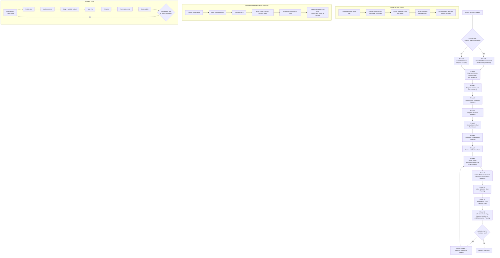

# Outcome-First Agentic Delivery Pipeline
## Rolling milestone planning, modality-aware evidence assembly, brownfield onboarding, smart model routing, and fault containment

## Purpose

This design describes a structured, fresh-agent software delivery system optimized for **making the intended development outcome concrete early, then delivering one bounded milestone at a time**. It keeps the strongest parts of the earlier experience-first design—SQLite orchestration memory, rolling milestone planning, validator-first acceptance, fixture-backed testing, mandatory refactoring, and fresh specialist agents—but generalizes the front half of the workflow so it is not limited to visual or UI-heavy work.

The central rule is no longer “show a visual experience before deep planning.” The new rule is:

> **Before deep milestone partitioning or implementation planning, make the intended outcome concrete and reviewable in the strongest modality available.**

For UI-heavy work, that reviewable artifact may still be an experience envelope. For other development work it may instead be an API contract bundle, a compiler corpus and diagnostics pack, a documentation information architecture with executable examples, a library recipe set, or an infrastructure rollout and rollback pack.

This pipeline is intentionally bounded to **development-related work**: applications, APIs, services, CLIs, compilers, toolchains, libraries, SDKs, data or schema work, platform or infrastructure changes, migrations, quality or security work, and technical documentation. It is **not** intended as a generic workflow for non-development domains.

This revision generalizes the earlier experience-first model in seven important ways:

1. It replaces the UI-centric center of gravity with a **milestone contract plus modality-aware evidence pack**.
2. It adds an explicit **work-classification step** so the system knows whether it is dealing with UI, API, compiler, library, docs, infra, data, or internal code work.
3. It introduces a generalized **scenario pack** abstraction that covers visible states, CLI behaviors, diagnostics, migration cases, failure drills, and documentation example paths.
4. It broadens preservation thinking into a **stability contract**, of which brownfield behavior preservation is only one subtype.
5. It replaces UX-only review gates with a broader **review and contract-lock** phase.
6. It generalizes the data model so review targets can be screens, endpoints, commands, compiler passes, docs sections, migrations, or runbooks.
7. It keeps experience-first delivery as a **first-class specialization** rather than the universal abstraction.

The result is a flow that still works extremely well for UI products, but also works for a compiler milestone, a documentation-only milestone, a library release, an API redesign, or an infrastructure hardening increment without forcing all of them through screen- and mock-centric language.

## 1. Core design principles

### 1.1 Reviewable outcome before deep internals
The system should reach a realistic, reviewable representation of the intended result early. That representation may be visual, textual, behavioral, contractual, executable, or operational depending on the work. Deep internal architecture should harden only after the milestone promise is concrete.

### 1.2 Milestone contract before deep partitioning
The system should not deeply decompose implementation until it knows what must be true when the milestone is done. Every active milestone needs an explicit contract.

### 1.3 Evidence packs are modality-aware
The early review artifact is not always a mock UI. The system should select an evidence-pack shape that matches the work: UI envelopes, API contracts, corpora, example sets, documentation structures, rollout packs, migration rehearsals, or other reviewable artifacts.

### 1.4 Scenario packs are mandatory
Every meaningful milestone needs explicit representative scenarios: happy paths, failures, edge cases, degraded behavior, compatibility cases, migration cases, or documentation example paths. UI states are one specialization of this broader idea.

### 1.5 Stability contracts matter as much as change intent
Brownfield safety is broader than “do not break the screen.” The system must lock what needs to remain stable, whether that is user-visible behavior, API compatibility, diagnostics, schemas, terminology, performance budgets, or operational safety.

### 1.6 Fresh agent per work unit
Every meaningful task is handled by a new agent run with tightly scoped context. Durable state lives outside the agent.

### 1.7 SQLite is orchestration memory
SQLite is the system of record for program state, milestone state, contracts, blockers, routing policy, digests, provenance, and validation outcomes. The repository remains the source of truth for code and source-controlled artifacts.

### 1.8 Minimal context, maximal clarity
Each agent receives the smallest useful packet required to do one job well. The context packer assembles this from structured records, ranked digests, and the local source neighborhood instead of replaying broad history.

### 1.9 Thin vertical slices
Production work happens through thin end-to-end slices that map to milestone value, compatibility protection, risk reduction, or necessary enabling work, not giant technical layers.

### 1.10 Fixture-first testing
Nothing is complete until it is tested. Automated tests should run against fixtures, fakes, stubs, deterministic adapters, or local simulators rather than live dependencies.

### 1.11 Refactor as a mandatory phase
After each slice is working and tested, a dedicated refactoring step improves structure while preserving approved behavior and locked contracts.

### 1.12 Locked contracts and controlled change
Once a milestone contract, evidence pack, stability contract, or technical contract is approved, later agents derive from it. They do not silently reinterpret it.

### 1.13 Autonomous continuation with explicit stop conditions
The orchestrator should keep moving while meaningful unblocked work exists. It pauses only when real user input, approval, access, or irreducible ambiguity is required.

### 1.14 Brownfield-aware entry modes
A non-empty codebase, existing product, or prior milestone should change the entry path. The system should not assume every project starts from blank-page ideation.

### 1.15 Milestones are first-class delivery units
The program is the long-lived product. A milestone is one bounded delivery increment inside that product. Milestone count should be discovered from scope and uncertainty, not assumed up front.

### 1.16 Model routing belongs to orchestration
Choosing which model should do which job is an orchestration concern, not something every prompt decides ad hoc. Routing policy should be explicit, stored, and revisable.

### 1.17 Model output is untrusted until validated
Agent output is a proposal, not authority. It must pass syntax, schema, semantic, scope, and policy checks before it becomes durable state or repository change.

### 1.18 Preserve stable knowledge and plan only the delta
The system should distinguish stable program memory from milestone-scoped change and should not micro-plan the whole program at once. Keep a coarse program map, a ranked milestone horizon, and a deep plan only for the active milestone.

### 1.19 Secrets are not normal project records
API keys, tokens, passwords, and similar secrets should not be stored as plaintext in generic project memory. SQLite stores metadata, readiness status, secure references, and validation timestamps only.

### 1.20 Evidence assembly is distributed and fidelity is selective
The early review artifact should be assembled from multiple bounded work units such as scaffold, backbone, artifact clusters, scenario packs, assembly, and consistency verification. The program-level evidence pack should be rich enough to validate direction and size milestones, but it does not need full-detail coverage for every future target before partitioning.

## 2. High-level operating model

The system has a **thin orchestrator** whose job is not to solve the project itself, but to:

- determine the current program state, milestone state, entry mode, work class, and modality,
- choose the next best work unit,
- assemble the right context packet,
- select the right model route,
- launch the correct specialist agent,
- validate output shape and scope,
- stage and accept only valid output,
- write accepted results back into SQLite and the repository where appropriate,
- update blockers, digests, dependencies, and milestone progress,
- and continue automatically until a real stop condition is reached.

The orchestrator should stay operationally simple. It should not become a giant reasoning agent. Meaningful work is pushed into specialized agents.

### 2.1 Core planning artifacts

#### Milestone contract
A milestone contract states what must be true when the milestone is done. It defines value, scope, success, interfaces, important scenarios, and non-goals at the fidelity appropriate for the active milestone.

#### Evidence pack
An evidence pack is the smallest reviewable set of artifacts that makes the milestone concrete enough to review, partition, and implement safely. In a UI product this may be an experience envelope. In a compiler it may be a corpus, diagnostics catalog, and CLI transcript set. In docs it may be an information architecture, glossary, sample pages, and executable examples.

#### Scenario pack
A scenario pack captures the cases that matter for design and verification: happy paths, failure paths, edge cases, degraded modes, compatibility cases, migration sequences, and example flows. UI state packs are one subtype of scenario pack.

#### Stability contract
A stability contract records what must remain true while the milestone changes other things. Brownfield preservation is one subtype. Others include backward compatibility, schema stability, diagnostic stability, terminology stability, performance budget stability, and rollout safety.

#### Validation profile
A validation profile defines how the milestone will later be proven correct. Examples include human review, contract tests, golden tests, differential tests, benchmark thresholds, docs linting, executable examples, dry runs, and rollback rehearsals.

### 2.2 Three nested scopes and one rolling planning horizon

#### Program
The long-lived product memory. It stores the program core, approved outer contract or evidence summary, stable constraints, and a coarse milestone horizon.

#### Active milestone
The one bounded delivery increment currently promoted for detailed planning and execution. It has its own contract, blockers, readiness state, and definition of done. It may also have a deeper active-target evidence pack if the program-level pack is too coarse for safe implementation.

#### Work unit
The smallest routable piece of work such as a research task, artifact shard, scenario pack, contract pass, slice, repair step, verifier pass, or refactor candidate.

A useful planning-depth rule is:

- **program** = coarse core plus approved reviewable outcome summary,
- **future milestones** = coarse shells with ordering hypotheses, key risks, and promotion conditions,
- **active milestone** = concrete contract, targeted evidence detail, technical derivation, and slice plan,
- **current work unit** = exact task with precise acceptance criteria.

Future milestones should remain coarse shells until activated, and later capabilities should often remain shell-level or outline-level in the program evidence pack until they are actually promoted.

### 2.3 Work classification and modality selection

Before the system commits to an evidence-pack shape, it should classify the work across these axes:

- **work class**: feature, migration, refactor, docs, quality, performance, security, infra, or research;
- **primary modality**: UI, API or service, CLI or toolchain, compiler, library or SDK, docs, infra or ops, data or schema, or internal code;
- **secondary modalities** where relevant;
- **primary consumers**: end users, developers, operators, maintainers, writers, or internal systems;
- **proof style**: human review, contract tests, golden tests, diff tests, benchmarks, linting, dry runs, or rehearsals.

This classification tells the system what kind of early concreteness it should build.

### 2.4 Entry modes

#### Greenfield program start
A brand-new project with no meaningful pre-existing code or product surface. It uses guided ideation and early outcome design, but it should not attempt whole-program micro-planning before the team has seen a credible evidence pack.

#### Brownfield program start
The system is starting from an existing product or repository. It should first map what exists, seed knowledge, and then shape the next meaningful increment against observed reality.

#### Active milestone continuation
The baseline product already exists because prior work completed. The next request may map to one milestone or may itself be split into multiple future milestones. Ideation becomes delta-scoped, not product-wide.

### 2.5 Default control loop

1. Read current program state, active milestone state, milestone horizon, locks, blockers, readiness, routing policy, and open work.
2. Refresh only the brownfield or repository digests that are relevant to the current decision.
3. If no approved evidence pack exists, or if the current pack is too coarse for the next decision, run or deepen only the necessary evidence-assembly work.
4. If no active milestone exists, or if the last approved contract invalidated the current horizon, run milestone sizing and partitioning.
5. Keep future milestones as shells unless and until they are promoted active.
6. Infer missing prerequisites from the chosen direction and existing constraints.
7. If a work unit is blocked, pick another meaningful eligible unit when possible.
8. Batch related missing user inputs instead of asking one question at a time.
9. Assemble a minimal context packet.
10. Route the task to an appropriate model profile.
11. Stage, validate, and accept only conforming output.
12. Recompute what is now unblocked and whether the active milestone is still the right boundary.
13. Continue automatically until no meaningful unblocked work remains.

### 2.6 Stop conditions

The system should stop only when at least one of the following is true and there is no other valuable unblocked work to do:

- a required user choice is unresolved,
- a required approval or sign-off is mandatory,
- a credential, account, repository permission, or API key is genuinely needed,
- a compliance or policy decision must come from the user,
- output repeatedly fails validation and cannot be safely repaired automatically,
- the active milestone boundary is unclear and cannot be responsibly inferred from the locked contract,
- or the system has reached a hard external blocker it cannot responsibly infer around.

A stop should be **batched and structured**. It should not drip-feed one small question at a time if multiple answers can be gathered together.

### 2.7 Major phases

The program flow moves through these major phases:

- **Phase B**: Brownfield reconnaissance and knowledge seeding
- **Phase 0**: Guided ideation or program shaping
- **Phase 1**: Structured intake, brownfield refresh, work classification, and execution readiness
- **Phase 2**: Program framing and horizon setup
- **Phase 3**: Outcome and consumer discovery
- **Phase 4**: Targeted decision research
- **Phase 5**: Contract and artifact architecture
- **Phase 6**: Distributed evidence-pack assembly
- **Phase 7**: Review and contract lock
- **Phase 8**: Scope sizing, milestone partitioning, and active-milestone activation
- **Phase 9**: Milestone-scoped technical derivation, targeted evidence deepening, and delta impact analysis
- **Phase 10**: Active-milestone slice planning and rolling schedule
- **Phase 11**: Autonomous slice execution loop
- **Phase 12**: Milestone hardening, release readiness, and continuation planning

Not every program or milestone must execute every phase in full. The entry router and skip rules decide the minimum safe path. The key rule is that deep planning happens only after the outcome is concrete enough to partition responsibly, and that this outcome should be assembled through bounded work units rather than one giant artifact-building pass.

## 3. Entry routing, modality model, and milestone lifecycle

### 3.1 Milestone 1 is the first committed subset, not the whole program
The first successful delivery cycle is still called **Milestone 1**. What changes is the meaning: Milestone 1 should be the first operational subset that makes the program promise real, not an attempt to exhaustively plan or finish the whole program.

### 3.2 The early review artifact comes before deep milestone partitioning, but it should be a modality-aware evidence pack
For greenfield work, the system should first shape the outer contract, assemble a distributed evidence pack, and lock the intended milestone or program direction. That pack should usually contain:

- a shared scaffold or frame where relevant,
- the primary path or backbone,
- shared interaction or contract primitives,
- shell-level or outline-level representation of major later capabilities,
- and deeper scenario coverage only where early milestone boundaries are likely to depend on it.

The point is not to fully render the whole program. The point is to make the program concrete enough that milestone boundaries stop being abstract guesses.

Brownfield and later-milestone work can often start with a narrower delta pack, but the same principle still applies: do not decompose deeply until the changed behavior or changed artifact set is concrete enough to reason about.

### 3.3 Evidence-pack shapes by modality

| Primary modality | Typical early evidence pack | Typical validation profile |
|---|---|---|
| UI or full-stack product | global shell, primary journey, shared interaction rules, shell-level later surfaces, scenario packs | coherence review, scenario coverage, UI tests |
| API or service | endpoint contracts, example requests and responses, auth and error matrix, sequence flows, fixture server | contract tests, compatibility checks, replay tests |
| CLI, compiler, or toolchain | corpus pack, CLI transcripts, diagnostics catalog, AST or IR snapshots, benchmark baseline | golden tests, differential tests, benchmark thresholds |
| Library or SDK | public API contract, examples, recipes, compatibility matrix, migration notes | example execution, type or API compatibility checks |
| Technical documentation | audience map, information architecture, outline, glossary, sample pages, executable examples | docs lint, broken-link checks, example execution, completeness review |
| Infra or ops | topology diff, rollout plan, rollback plan, runbook pack, dry-run logs | policy checks, rehearsal runs, rollback verification |
| Data or schema | schema diff, migration plan, compatibility matrix, fixture data, rollback path | migration tests, data validation, compatibility verification |

The UI-shaped experience envelope remains a first-class specialization of this broader abstraction. It is no longer the universal one.

### 3.4 Milestone count is discovered, not predeclared
The system should decide whether the work fits in one milestone or multiple based on:

- breadth of user or consumer paths,
- number and volatility of integrations,
- scenario and edge-case complexity,
- preservation or compatibility risk,
- architectural cliff edges or migration steps,
- irreversibility of contracts or data changes,
- performance or rollout sensitivity,
- documentation coverage burden,
- and how much real learning is still required.

Small, low-risk scopes may collapse into a single milestone. Larger or riskier scopes should expand into a sequence of milestone shells.

### 3.5 Rolling planning depth and evidence fidelity
A useful operating rule is:

- **program horizon**: coarse map of capabilities, ordering hypotheses, and known risks;
- **program evidence pack**: global scaffold, primary path, major target shells, and fidelity tags;
- **active milestone**: concrete contract, optional active-target deepening, technical derivation, and slice plan;
- **current work unit**: exact task with precise acceptance criteria.

Future milestones should contain only enough detail to preserve intent, ordering, main dependencies, and promotion conditions. They should not receive full slice planning or fully detailed artifacts until promoted.

### 3.6 Phase-skipping and planning-depth rules

#### Ideation
- **Run fully** for greenfield starts.
- **Run narrowly** for brownfield onboarding when the next increment still needs scope shaping.
- **Skip or nearly skip** for later milestones when the request is already concrete.

#### Evidence-pack assembly or simulation
- **Required** when the requested change affects user flows, visible behavior, external contracts, documentation experience, operational safety, or product meaning.
- **Targeted** when the change touches only a narrow area.
- **Skippable** only when the behavior is already fully specified and additional simulation would add no decision value.

#### Research
- **Targeted only.** Research should answer the next real design, partitioning, or implementation question, not exhaustively map every future milestone before it is active.

#### Milestone partitioning
- **Mandatory after contract lock** for greenfield starts and any request whose true size is still unclear.
- **Optional but recommended** when a later milestone request looks large enough to split again.

#### Brownfield refresh
- **Heavy** at the start of brownfield onboarding.
- **Incremental** later, limited to changed areas and recently touched modules.

#### Technical derivation and slice planning
- **Deep only for the active milestone.**
- **Shallow or absent** for future milestones, which should remain shells with promotion conditions.

### 3.7 Milestone close-out
At the end of every milestone, the system should do more than mark work complete. It should also:

- audit milestone success against the milestone contract,
- extract follow-on ideas and discovered dependencies,
- recut the milestone horizon if implementation learnings changed sequencing,
- classify carry-forward items as future milestone shells, seeds, backlog, refactor candidates, or audit gaps,
- update the stable program core if the milestone changed durable product truth,
- and prepare the next activation if continuation makes sense.

### 3.8 Seeds, backlog, milestone shells, and continuation
A useful continuation model has four distinct carry-forward classes:

- **future milestone shells**: coarse future increments with value hypothesis, main dependencies, key risks, and promotion conditions;
- **future seeds**: ideas that should surface later when certain conditions become true;
- **backlog items**: known possible work that is not currently active;
- **threads or investigations**: ongoing cross-milestone knowledge that does not belong to one slice.

This keeps the active milestone focused while preserving useful future knowledge.

### 3.9 Terminology migration from the earlier experience-first model

| Earlier term | Generalized term | Notes |
|---|---|---|
| experience envelope | evidence pack | UI envelopes remain a subtype |
| experience spine | backbone or primary path | Works for flows, CLIs, docs, and pipelines |
| surface cluster | artifact cluster | May group screens, endpoints, compiler artifacts, or docs sections |
| mock shard | artifact shard | Any bounded review artifact produced independently |
| state pack | scenario pack | Covers states, diagnostics, failures, migrations, and examples |
| active surface set | active target set | The targets requiring deepening now |
| preservation contract | stability contract | Brownfield preservation is one subtype |
| UX review and lock | review and contract lock | Works for non-visual work too |

## 4. Phase-by-phase design

## Phase B: Brownfield reconnaissance and knowledge seeding

### Objective
Establish a trustworthy working picture of an existing product, repository, and document set before milestone planning starts.

### Why it exists
If the system starts from a real codebase and behaves like a greenfield planner, it will repeatedly propose changes that conflict with reality. Brownfield work needs a factual baseline first.

### Recommended brownfield substeps

#### B.1 Repository and topology scan
Map major directories, service boundaries, package structure, entry points, shared modules, deployment clues, tooling surfaces, and documentation assets.

#### B.2 Document and decision ingest
Ingest ADRs, PRDs, READMEs, runbooks, tickets, docs structures, and existing design documents, then classify their trust and freshness.

#### B.3 Runtime and dependency inventory
Detect key frameworks, libraries, testing stacks, infrastructure patterns, package managers, integration SDKs, compilers, build systems, linters, and documentation generators already in use.

#### B.4 Behavior and contract extraction
Infer likely domain entities, route surfaces, APIs, event flows, CLI behaviors, public package APIs, docs structures, external boundaries, and operational seams.

#### B.5 Test and fixture landscape mapping
Determine which areas already have tests, what fixture patterns exist, where golden baselines exist, where docs examples run, and where stability risk is high because verification is weak.

#### B.6 Hotspot and debt detection
Identify complex files, high-churn modules, weakly tested zones, likely integration pain points, and suspected architectural seams.

#### B.7 Knowledge seeding and trust scoring
Store condensed, reusable findings as structured knowledge records and assign trust levels so later agents know what is observed, inferred, or verified.

### Recommended agents
- repository mapper
- document ingester
- dependency and runtime detector
- behavior extractor
- test landscape mapper
- hotspot detector
- knowledge seeder

### Outputs
- `brownfield_snapshot`
- `repo_topology`
- `dependency_inventory`
- `runtime_inventory`
- `integration_inventory`
- `behavior_contract_guess`
- `artifact_surface_map`
- `test_landscape`
- `hotspot`
- `brownfield_risk`
- `knowledge_seed`
- `brownfield_entry_recommendation`

### Minimal context
This phase needs the repository, available documents, deployment hints, and any user-stated milestone intent. It does not need full later-phase planning context.

### Gate
The system should not leave this phase until it can answer:

- what already exists,
- what is probably important to preserve or keep compatible,
- what is risky or under-documented,
- which technologies and integrations are already in play,
- and whether the next step should be full ideation, narrow milestone shaping, or direct intake.

## Phase 0: Guided ideation or program shaping

### Objective
Turn either a blank-page request or a continuation request into a coherent product direction, current opportunity frame, and first-value outcome target without pretending the whole program can be planned in detail yet.

### How this changes by entry mode

#### Greenfield program start
Run the full ideation flow. The goal is to define the product direction and first believable evidence pack, not to micro-plan the whole roadmap.

#### Brownfield program start
Do not restart whole-product ideation unless the product direction itself is unclear. Usually the job is to clarify the next meaningful increment against existing system reality.

#### Active milestone continuation
Scope the new request only. If the request is too large, capture it as a capability expansion idea and let Phase 8 split it into multiple milestones after outcome clarification.

### Recommended substeps

#### 0.1 Problem or opportunity framing
Clarify what value the product or requested expansion should create and why now.

#### 0.2 Impacted consumers and contexts
Identify the users, developers, operators, maintainers, or readers who matter first.

#### 0.3 Stability boundary definition
In brownfield or continuation work, make explicit what must remain unchanged.

#### 0.4 Outcome and success framing
Define what success means and how it will be recognized.

#### 0.5 Constraints and givens
Capture technical, business, compliance, operational, documentation, and timeline constraints.

#### 0.6 Candidate directions
Generate options when the request is broad enough to benefit from alternatives.

#### 0.7 Coarse capability mapping
Generate a rough set of capabilities or work areas implied by the idea, but do not decompose them into full technical plans.

#### 0.8 Outcome thesis
Summarize what the primary consumer should notice quickly and what first value the product or increment should deliver.

#### 0.9 Scope shaping for now versus later
Separate what must be represented in the early evidence pack from what can remain a future milestone possibility.

### Outputs
- `program_brief`
- `milestone_brief`
- `problem_statement`
- `primary_consumers`
- `constraints`
- `success_metric`
- `scope_boundary`
- `stability_boundary`
- `capability_map`
- `selected_direction`
- `outcome_thesis`
- `open_question`
- `locked_decision`

### Minimal context
The ideation or shaping agents need only the current request, answered questions, unresolved questions, known constraints, and—if relevant—the brownfield digest and stability hints.

### Gate
The system should not leave this phase until it has:

- a coherent product or increment objective,
- success criteria,
- a coarse capability map,
- a stability boundary when relevant,
- and enough clarity to design an early evidence pack.

It should not try to enumerate the whole implementation backlog here.

## Phase 1: Structured intake, brownfield refresh, work classification, and execution readiness

### Objective
Convert program or milestone intent into a structured requirement profile, readiness model, classification record, and early dependency plan so later phases do not stall.

### Why this phase matters even after brownfield mapping
Brownfield reconnaissance tells the system what exists. This phase turns that into operational planning: preferred technologies, environment choices, credentials, access, model policy, execution assumptions, and early indicators of whether the scope is likely to need multiple milestones.

### Recommended intake dimensions

#### 1.1 Product and team context
Capture project naming, repository ownership, team reality, review expectations, and handoff assumptions.

#### 1.2 Technology preferences
Capture preferred languages, frameworks, styling systems, testing tools, package managers, infrastructure choices, documentation generators, and explicit “do not use” technologies.

#### 1.3 Environment and deployment assumptions
Capture local versus hosted, target cloud, runtime constraints, CI or CD expectations, environments, and data storage preferences.

#### 1.4 Integration inventory
Capture third-party APIs, auth providers, data systems, messaging systems, analytics, AI providers, internal services, external toolchains, and docs publishing pipelines.

#### 1.5 Credential and access forecasting
Infer which systems require credentials, account access, repository permissions, or later live validation.

#### 1.6 Brownfield refresh
If starting from an existing system, confirm whether the initial brownfield findings are sufficient or whether the current request needs a deeper area-specific refresh.

#### 1.7 Scope and complexity signals
Capture or infer the signals that matter for later milestone partitioning, such as path count, integration density, risky migrations, stability sensitivity, performance sensitivity, docs breadth, and uncertainty concentration.

#### 1.8 Work classification and modality selection
Classify the work class, primary modality, secondary modalities, primary consumers, and proof style. This determines the default evidence-pack shape and validation profile.

#### 1.9 Model policy capture
Capture cost sensitivity, provider restrictions, compliance constraints, preferred model families, and whether certain classes of work should route to specific capability profiles.

#### 1.10 User-input batching
Bundle all near-term missing inputs into one structured request.

### Recommended agents
- requirement schema agent
- technology preference capture agent
- environment and deployment capture agent
- integration inventory agent
- credential and access forecaster
- brownfield refresh selector
- scope signal extractor
- work classifier
- validation-profile selector
- model policy capture agent
- user-input batching agent
- readiness classifier

### Outputs
- `structured_requirement_profile`
- `technology_preference`
- `deployment_preference`
- `integration_requirement`
- `credential_requirement`
- `access_requirement`
- `brownfield_constraint`
- `scope_signal`
- `complexity_signal`
- `work_class`
- `primary_modality`
- `secondary_modality`
- `primary_consumer_set`
- `proof_style`
- `validation_profile_hint`
- `planning_horizon_hint`
- `model_policy_preference`
- `input_manifest`
- `readiness_check`
- `blocking_dependency`
- `user_input_request_batch`

### Important secret-handling rule
This phase may determine that secrets are needed, but it should not store raw secrets in ordinary records. It creates the requirement, requests secure submission, and stores only secure references and readiness metadata.

### Minimal context
This phase needs the program brief or milestone brief, locked decisions, selected direction, capability map, preference signals, brownfield digest, and any repository or vendor references already known.

### Gate
The phase exits only when near-term requirements are classified as:

- already known,
- inferred but unconfirmed,
- must ask now,
- needed later,
- or optional.

It should also leave behind explicit scope and complexity signals, work-classification data, and a validation-profile hint so later milestone decisions are informed rather than improvised.

## Phase 2: Program framing and horizon setup

### Objective
Turn ideation and readiness outputs into stable program memory, a provisional planning horizon, and reusable cores that later agents can rely on without reading the full history.

### Why this phase should stay provisional
Before the outcome is locked, the system should not pretend to know the final milestone breakdown. This phase creates stable program memory and, at most, a provisional initial milestone hint.

### Agents
- program framing agent
- provisional milestone framing agent
- horizon policy agent
- terminology agent
- state initializer
- blocker summarizer

### Outputs
- `program_core`
- `milestone_core`
- `milestone_horizon_policy`
- `glossary`
- `non_goals`
- `program_state`
- `milestone_state`
- `risk_register`
- `readiness_summary`

### Minimal context
Only shaping outputs, readiness outputs, brownfield findings, locked decisions, and unresolved questions should be passed in.

### Gate
Later agents should be able to understand the product direction, the current request, and the current planning horizon from these cores alone. For greenfield work, any milestone core produced here should be treated as provisional until Phase 8 finalizes activation.

## Phase 3: Outcome and consumer discovery

### Objective
Define the consumer paths, moments of value, setup touchpoints, changed behaviors, preserved behaviors, and failure conditions that the early evidence pack must represent before milestone boundaries harden.

### Brownfield-specific requirement
In existing products, this phase must identify both **changed paths** and **preserved paths**. The system should not accidentally redefine adjacent parts of the product.

### How this generalizes by modality
- In a UI product, this phase discovers journeys, screens, and states.
- In an API or service, it discovers consumers, calls, sequences, and error paths.
- In a compiler, it discovers source-to-output flows, diagnostics expectations, and compatibility obligations.
- In documentation, it discovers reader tasks, navigation paths, and example obligations.
- In infra work, it discovers operator workflows, rollout paths, and failure drills.

### Agents
- consumer-path mapper
- jobs-to-be-done agent
- failure-state agent
- setup and readiness agent
- stability-constraint agent

### Outputs
- `usage_path`
- `path_delta`
- `job_statement`
- `moment_of_value`
- `failure_mode`
- `setup_touchpoint`
- `consumer_boundary`
- `stability_constraint`

### Minimal context
This phase needs the program core, provisional milestone core, target consumers, scope boundary, outcome thesis, brownfield stability hints, work classification, and readiness summary.

### Gate
The phase exits when the primary consumer outcome, setup or permission touchpoints, changed or preserved path segments, and key boundary conditions are explicit enough to build the early evidence pack.

## Phase 4: Targeted decision research

### Objective
Research only the patterns, edge cases, and risks needed to justify the current direction and the next milestone-partitioning decision.

### Recommended parallel agents
- pattern research agent
- comparable-product or system research agent
- accessibility and inclusivity agent where relevant
- edge-case and risk agent
- brownfield conflict agent
- standards or compatibility agent when the work touches protocols, languages, or documentation rules

### Outputs
- `pattern_finding`
- `recommendation`
- `accessibility_requirement`
- `edge_case_set`
- `risk_note`
- `brownfield_conflict_note`
- `compatibility_note`

### Minimal context
Research agents get a sharply scoped brief for the exact question they are answering. They do not need the whole project archive, and they should not be asked to exhaustively research future milestones that are not yet active.

### Gate
The program should exit this phase with a coherent set of recommended patterns, clear edge-case coverage, and enough confidence to build the evidence pack without pretending every future capability has already been researched.

## Phase 5: Contract and artifact architecture

### Objective
Translate the approved direction into a milestone contract sketch, artifact graph, scenario model, impact map, and decomposition plan that are rich enough to assemble an early evidence pack without asking one agent to design the whole milestone in one pass.

### Why artifact decomposition matters
Large development efforts rarely fit into one artifact-building context window. Before Phase 6 starts, the system should explicitly decide:

- which targets belong to the shared scaffold,
- which paths form the backbone,
- which review targets can be grouped into bounded artifact clusters,
- which scenarios should be injected as reusable scenario packs,
- which capabilities need only shell-level or outline-level representation for now,
- and which targets are likely active-milestone candidates that deserve deeper fidelity before partitioning.

### Agents
- contract architect
- path or flow architect
- artifact-spec agent
- behavior-model agent
- scenario-coverage agent
- impact mapper
- stability-guard agent
- artifact decomposition planner
- artifact clustering agent
- fidelity-tier planner

### Outputs
- `milestone_contract_outline`
- `artifact_graph`
- `artifact_spec`
- `behavior_model`
- `scenario_matrix`
- `impact_map`
- `stability_guard`
- `artifact_cluster`
- `fidelity_tier`
- `shared_contract_outline`
- `access_rule`

### Minimal context
These agents need the program core, provisional milestone core, usage paths, recommendations, accessibility requirements, stability constraints, scope boundary, readiness summary, classification records, and any brownfield target map that constrains what can change.

### Gate
Every important changed target should have:

- a purpose,
- entry and exit conditions where relevant,
- inputs and outputs,
- actions or behavior expectations,
- data requirements,
- scenario coverage,
- setup or degraded conditions where relevant,
- stability expectations,
- a clear impact map into existing targets,
- an assigned cluster or scaffold classification,
- and a fidelity target.

The result should be detailed enough to support distributed evidence assembly, but not yet a full implementation plan for the whole program.

## Phase 6: Distributed evidence-pack assembly

### Objective
Assemble an early believable evidence pack through multiple bounded agentic steps rather than a single giant prototype or document-building run.

### Core rule
For large programs, the correct output of this phase is usually a **program-level evidence pack**, not a fully detailed artifact set for every future milestone. The pack should be good enough for stakeholder feedback and milestone sizing. Detailed expansion beyond the likely early milestone should usually wait.

### Recommended substeps

#### 6.1 Artifact-graph confirmation
Validate or refine the artifact graph from Phase 5. Confirm:

- shared scaffold,
- shared primitives or contract fragments,
- backbone paths,
- artifact clusters,
- shell-only future capabilities,
- scenario-pack obligations,
- and fidelity tiers.

#### 6.2 Shared scaffold and contract pass
One or more agents create the shared frame, common contract scaffolding, taxonomy, naming, glossary, or structural substrate that later artifact shards attach to.

#### 6.3 Backbone assembly
A small number of agents build the critical first-value path end to end. This is the minimum artifact set that must feel real early.

#### 6.4 Artifact-cluster shards
Instead of one agent building the entire review artifact, each agent receives one bounded artifact cluster and produces a shard for that area only.

#### 6.5 Scenario-pack injection
Specialized agents add failure cases, degraded cases, compatibility cases, migration sequences, example paths, diagnostics cases, or state coverage to the relevant clusters. This separates “shape” work from “scenario coverage” work and keeps context packets smaller.

#### 6.6 Assembly and consistency verification
An assembler agent integrates the scaffold, backbone, and shards into one reviewable evidence pack. A separate consistency verifier checks naming continuity, path integrity, contract alignment, missing scenario obligations, and shared-fragment drift.

#### 6.7 Selective deepening before partitioning
Only the targets needed to validate the program promise or to distinguish the active milestone from later milestones should get deeper fidelity now. Later capabilities can remain shell-level, outline-level, or simulated until they are promoted.

### Modality examples

#### UI product
The pack may contain a shell, navigation scaffold, primary journey, cluster shards, and scenario packs.

#### API or service
The pack may contain endpoint contracts, request and response examples, auth and error matrices, sequence diagrams, and fixture-backed examples.

#### Compiler or CLI
The pack may contain a supported corpus slice, CLI transcripts, diagnostics catalog, AST or IR snapshots, compatibility notes, and a benchmark baseline.

#### Library or SDK
The pack may contain public API contracts, recipe examples, migration notes, and compatibility matrices.

#### Documentation-only work
The pack may contain the information architecture, outline, glossary, representative pages, executable examples, link map, and review checklist.

#### Infrastructure or platform
The pack may contain topology diffs, rollout and rollback plans, runbook fragments, dry-run evidence, and guardrail checks.

### Agents
- artifact-graph planner
- shared-scaffold builder
- shared-contract builder
- backbone builder
- artifact-cluster builder
- scenario-pack builder
- assembler
- consistency verifier
- reviewer or critic

### Outputs
- `evidence_pack`
- `artifact_graph`
- `artifact_cluster`
- `artifact_shard`
- `scenario_pack`
- `assembly_result`
- `consistency_report`
- `evidence_gap`
- `shared_contract`
- `scaffold_fragment`

### Minimal context
This phase should not use one giant context packet. The artifact-graph planner may see the broad program structure, but scaffold builders, cluster builders, and scenario-pack builders should receive only their assigned target, the shared contract, relevant specs, relevant fixtures, and the surrounding rules they must honor.

### Gate
The phase exits when:

- stakeholders can review a coherent evidence pack,
- the core value loop is believable,
- major capabilities are represented at least as shells or outlines,
- likely early-milestone targets have enough detail to support partitioning,
- consistency checks pass or remaining gaps are explicitly recorded,
- and anything not yet deeply represented is intentionally tagged as shell-level or deferred rather than silently missing.

## Phase 7: Review and contract lock

### Objective
Convert feedback on the assembled evidence pack into durable contracts while distinguishing what is locked as shell-level direction from what is locked as high-fidelity behavior or structure.

### Brownfield-specific requirement
The system should explicitly lock both the new change contract and the stability boundaries around adjacent unchanged behavior.

### Review rule
Approval can cover mixed fidelity. Some targets may be locked as detailed behavior, while others are locked only as shell-level direction. The reviewer should explicitly mark which targets need active-milestone deepening later and which are already specified well enough.

### Agents
- review orchestrator
- feedback synthesizer
- decision locker
- stability checker
- gap triage agent
- validation-profile confirmer

### Outputs
- `review_feedback`
- `approved_program_contract`
- `approved_milestone_contract`
- `stability_contract`
- `locked_decision`
- `change_request`
- `active_target_priority`
- `validation_profile`

### Minimal context
These agents need the evidence pack, artifact graph, artifact shards, assembly result, consistency report, scenario packs, feedback, and stability constraints.

### Gate
Once approved, the relevant contract becomes binding at the stated fidelity. For greenfield work, it becomes the source document for milestone sizing and partitioning. For later or brownfield work, it becomes the contract for the active increment unless Phase 8 decides the request should be split further.

## Phase 8: Scope sizing, milestone partitioning, and active-milestone activation

### Objective
Use the approved contract and current constraints to determine whether the work fits in one milestone or several, create an ordered milestone horizon, activate only the next milestone for deep planning, and identify which targets need deeper treatment now versus later.

### Why this phase belongs after contract lock
Before the team has seen a concrete outcome, milestone boundaries are often speculative. After the outcome is concrete, the system can partition around real consumer paths, artifact clusters, scenario density, dependency cliffs, and learning points rather than abstract guesses.

This does **not** require every future target to be fully elaborated. Shell-level representation is enough for later capabilities as long as the outer promise and likely early-milestone boundaries are visible.

### Partitioning criteria
Partition around:

- independent value steps,
- dependency cliffs and integration boundaries,
- uncertainty concentrations,
- stability or compatibility risk,
- irreversible schema or contract changes,
- benchmark sensitivity,
- testability and release safety,
- documentation coverage or maintenance cost,
- subsystem boundaries,
- and where feedback from real implementation is likely to change later decisions.

### Agents
- scope sizing agent
- milestone partitioner
- risk-ordered scheduler
- promotion-condition writer
- active-milestone selector
- target-promotion planner

### Outputs
- `scope_assessment`
- `milestone_shell`
- `milestone_order`
- `planning_horizon`
- `milestone_activation`
- `promotion_condition`
- `deferred_capability`
- `milestone_dependency`
- `active_target_set`
- `deferred_target_shell`

### Minimal context
This phase needs the approved program or milestone contract, capability map, artifact graph, active-target priorities, readiness summary, risk register, classification records, brownfield findings, constraints, and current product state.

### Gate
The phase exits only when:

- the system knows whether one milestone is enough or multiple are needed,
- the active milestone has a crisp contract,
- future milestones exist only as coarse shells,
- anything deferred is intentionally recorded rather than forgotten,
- the active target set is explicit,
- any required active-milestone evidence deepening is scheduled,
- and the active milestone is ready to receive deep technical derivation.

## Phase 9: Milestone-scoped technical derivation, targeted evidence deepening, and delta impact analysis

### Objective
Derive the technical shape only for the active milestone from the locked contract and the existing system reality, and deepen only the active targets if the program-level evidence pack is still too coarse for safe implementation.

### Why this phase changes in a rolling milestone system
The question is not “what should the whole system be?” The real question is “what must change now, what can stay, what must migrate now versus later, and how do we preserve the future milestone horizon without over-specifying it?”

Future milestones may receive boundary notes or dependency warnings, but they should not receive full technical contracts yet.

### Optional targeted evidence deepening
If the active milestone still contains shell-level or lightly specified targets that are too abstract for safe derivation, run a milestone-scoped deepening pass now. That pass should:

- reuse shared contracts and existing artifact shards,
- expand only the active target set,
- enrich only the active scenario packs and fixtures,
- and avoid program-wide remocking or redocumenting.

### Agents
- feasibility analyst
- domain model agent
- contract writer
- policy or rules agent
- integration boundary agent
- credential boundary agent
- delta impact analyst
- migration planner
- rollback planner
- future-boundary note writer
- active-target elaborator
- scenario-pack refiner

### Outputs
- `technical_shape`
- `domain_entity`
- `api_contract`
- `event_contract`
- `validation_rule`
- `policy_rule`
- `integration_boundary`
- `credential_binding_spec`
- `delta_impact_map`
- `migration_plan`
- `rollback_plan`
- `future_boundary_note`
- `active_target_contract`
- `milestone_evidence_delta`
- `performance_budget`

### Minimal context
These agents need the active milestone contract, active target set, relevant artifact shards, shared contracts, behavior models, scenario packs, stability contract, risk register, technology preferences, readiness summary, brownfield findings, and current technical assumptions.

### Gate
The phase exits when the system understands:

- what must be built for the active milestone,
- what existing structures must be touched now,
- what live integrations are real versus fixture-backed for now,
- what migration or compatibility boundaries exist,
- what rollback or protection strategy is needed if risky areas change,
- what boundary notes should be carried forward without fully planning future milestones,
- and, if evidence deepening was required, that the active targets are now specific enough to support slice planning safely.

## Phase 10: Active-milestone slice planning and rolling schedule

### Objective
Break the active milestone into thin, end-to-end slices that produce value or milestone protection while keeping future milestones intentionally shallow.

### Important refinement
Only the active milestone should receive deep slice planning. Future milestones should remain as shells with value hypotheses, key dependencies, and promotion conditions.

Within the active milestone, not every essential slice is a net-new feature slice. Some are:

- **feature slices** that add new value,
- **migration slices** that move existing behavior safely,
- **stability slices** that add tests or guards around untouched but fragile behavior,
- **enablement slices** that unblock later value while staying milestone-scoped,
- **hardening slices** that are required for safe release of the milestone,
- **documentation slices** that are part of the milestone contract rather than afterthoughts.

### Agents
- slice planner
- dependency mapper
- acceptance criteria agent
- test planner
- fixture planner
- blocker-aware scheduler
- model-routing hint generator
- horizon guard

### Outputs
- `slice`
- `slice_plan`
- `dependency_edge`
- `acceptance_criteria`
- `test_matrix`
- `fixture_plan`
- `execution_priority`
- `blocker_strategy`
- `wave`
- `routing_class`
- `model_route_hint`
- `milestone_rollover_hint`

### Minimal context
The planner needs the active milestone contract, technical contracts, current repository map, stability contracts, readiness state, brownfield hotspots, validation profile, and what has already been built.

### Gate
Each slice must have:

- one clear active-milestone purpose,
- acceptance criteria,
- required tests,
- required fixtures,
- allowed file scope,
- dependency position,
- blocker classification,
- and a routing class that tells the model router what kind of work it is.

No future milestone should receive a full slice plan at this stage.

## Phase 11: Autonomous slice execution loop

This is the core delivery loop for the **active milestone**. Every slice goes through the same disciplined sequence, and the orchestrator keeps selecting the next eligible slice until the active milestone is complete or all meaningful unblocked work is exhausted.

### 11.0 Loop controller behavior
After each state update, the orchestrator should:

- recompute eligible work,
- prefer unblocked slices,
- preserve active-milestone priorities,
- switch around blocked work when alternatives exist,
- batch missing user inputs when all good moves depend on them,
- and continue automatically without asking for confirmation after every successful unit.

When the active milestone is complete, the system should transition to Phase 12 rather than immediately decomposing future milestones.

### 11.1 Model routing step
Before launching each agent, a model router should classify the work and choose:

- a primary model capability profile,
- an allowed fallback chain,
- a verifier profile,
- a cost or latency budget,
- and escalation conditions.

This should be stored as a durable decision, not treated as transient prompt trivia.

#### Outputs
- `model_route_decision`
- `model_budget`
- `model_fallback_chain`
- `model_escalation_rule`

### 11.2 Test design step
Before implementation is accepted, a test planner expands the slice into explicit test cases.

#### Outputs
- `test_case`
- `test_group`
- `fixture_requirement`

#### Why this happens first
It forces the system to define what “working” means before code or artifact changes are considered done.

### 11.3 Implementation step
A fresh implementation agent builds the slice using approved contracts, allowed file scope, and fixture-backed adapters or fixtures.

#### Rules
- Implement only the assigned slice.
- Respect locked milestone, stability, and technical contracts.
- Use fixtures, stubs, fakes, or deterministic adapters for external dependencies.
- Respect technology preferences and execution constraints.
- Avoid live dependency calls in automated work.
- Build against approved boundaries when live integrations are unavailable.

#### Outputs
- repository or artifact changes
- `implementation_summary`
- `touched_asset`
- `implementation_note`

### 11.4 Output staging and validation step
No implementation, refactor, or plan output should be accepted directly. It should first be staged and validated.

#### Validation layers
- syntax and structural shape,
- schema conformance,
- record-type correctness,
- reference integrity,
- file-scope compliance,
- stability-contract compliance,
- and policy or risk checks.

If the output is malformed, partial, contradictory, or out of scope, it should be repaired or quarantined instead of accepted.

#### Outputs
- `staged_output`
- `validation_result`
- `repair_request`
- `quarantine_item`

### 11.5 Test execution and completion step
A test agent writes any missing tests and runs the slice test matrix.

#### Required categories
Depending on the slice, these may include:

- unit tests,
- component tests,
- integration tests using fixture-backed boundaries,
- contract tests,
- migration or stability tests,
- targeted regression tests,
- scenario tests,
- docs or example execution,
- golden tests or differential tests,
- and benchmark or budget checks.

#### Outputs
- `test_result`
- `coverage_note`
- `failure_report`

If tests fail, a fixer agent or implementation agent receives a narrow remediation unit.

### 11.6 Mandatory refactoring step
Once the slice is functionally correct and green under required tests, a dedicated refactoring agent runs.

#### Purpose
This improves internal shape while preserving externally visible behavior, contracts, and validation expectations.

#### Allowed work
- simplify,
- extract,
- rename,
- reorganize local structure,
- improve fixture boundaries,
- reduce duplication,
- improve test clarity,
- and make future slices easier.

#### Not allowed
- change approved behavior,
- break stability contracts,
- silently alter locked contracts,
- widen scope into unrelated modules,
- or redesign the whole system.

#### Outputs
- repository refactor changes
- `refactor_summary`
- `refactor_issue`
- `refactor_candidate`
- `before_after_metric`

### 11.7 Regression verification step
After refactoring, a verifier reruns relevant checks and compares the slice against acceptance criteria, the active milestone contract, the validation profile, and any stability contracts.

#### Outputs
- `verification_result`
- `acceptance_check`
- `contract_conformance_result`
- `stability_check`

Only after this step passes is the slice considered complete.

### 11.8 State update step
A state writer closes the slice, updates dependencies, records blocker changes, stores routing outcomes, and emits a digest for future reuse.

#### Outputs
- `slice_status_update`
- `run_digest`
- `trace_link`
- `blocker_set`
- `routing_outcome`
- `milestone_progress_update`
- `next_action`

### 11.9 Continue-or-pause decision step
A control agent evaluates remaining work.

#### Rules
- If at least one eligible unit is unblocked, continue automatically.
- If the current path is blocked but alternative valuable work exists, switch and continue.
- If all remaining good moves are blocked by the same missing input, approval, or credential, emit one consolidated request.
- If repeated corruption or validation failure affects a work type, escalate model route or quarantine that work class until repaired.
- If the active milestone is complete, stop deep execution work and advance to Phase 12.

#### Outputs
- `user_input_request_batch`
- `stop_reason`
- `resume_condition`
- `escalation_event`

## Phase 12: Milestone hardening, release readiness, and continuation planning

### Objective
After slices accumulate, run broader checks, determine milestone readiness, refresh the milestone horizon, and prepare the program for continuation.

### Agents
- wave verifier
- accessibility verifier where relevant
- performance budget agent
- security and policy checker
- live-readiness checker
- milestone auditor
- seed and backlog synthesizer
- horizon refresh planner
- release readiness summarizer

### Outputs
- `wave_verification`
- `performance_note`
- `accessibility_audit`
- `integration_readiness`
- `release_readiness`
- `milestone_audit`
- `future_seed`
- `backlog_candidate`
- `milestone_horizon_update`
- `next_milestone_option`
- `program_digest`

### Why this phase matters in a rolling milestone system
The system should leave each milestone with more than a yes-or-no release decision. It should also leave behind a clean continuation surface and an updated horizon so the next milestone can be activated without reopening the whole project.

### Gate
The milestone should not close until the system knows:

- whether the milestone met its definition of done,
- what unresolved risks remain,
- what live validations are still pending,
- what future ideas were discovered during the work,
- whether the milestone horizon needs to be recut because implementation changed the program understanding,
- and whether the next likely milestone should be proposed or activated immediately.

## 5. SQLite-native data model

The major architectural shift remains the same: orchestration memory is represented as structured data in SQLite instead of markdown handoff files, while raw secrets stay outside the ordinary record store.

### 5.1 Recommended storage strategy

#### Control tables
These track the state of the system itself.

- `projects`
- `program_state`
- `milestones`
- `milestone_horizons`
- `milestone_state`
- `work_units`
- `agent_runs`
- `dependencies`
- `locks`
- `input_requirements`
- `stop_conditions`

#### Generic record store
Most phase outputs should still live in a versioned typed record store. The record envelope should carry at least:

- project scope,
- milestone scope,
- record type,
- record key,
- version,
- status,
- lock state,
- trust level,
- schema version,
- tags,
- structured payload,
- human-readable summary,
- provenance,
- supersession link,
- and creation timestamp.

This remains the main replacement for file-based handoffs.

#### Brownfield knowledge tables
These track what was observed or inferred from existing systems.

- `codebase_snapshots`
- `doc_ingestions`
- `dependency_inventories`
- `behavior_maps`
- `artifact_surface_maps`
- `test_landscapes`
- `hotspots`
- `knowledge_seeds`

#### Readiness and access metadata tables
These track what the system needs from users or external systems.

- `credential_requirements`
- `credential_bindings`
- `access_requirements`
- `user_preferences`
- `integration_targets`
- `deployment_targets`

#### Model-routing tables
These make smart model switching durable and auditable.

- `model_policies`
- `model_assignments`
- `fallback_events`
- `escalation_events`
- `routing_outcomes`

#### Contract and evidence-assembly tables
These let the system build large review artifacts without a monolithic agent run.

- `review_targets`
- `artifact_graphs`
- `artifact_clusters`
- `artifact_shards`
- `scenario_packs`
- `shared_contracts`
- `assembly_runs`
- `consistency_reports`
- `fidelity_assignments`

When the work is UI-heavy, review targets may be screens, flows, and state groups. When it is compiler work they may be passes, corpora, diagnostics packs, or snapshots. When it is docs work they may be sections, examples, glossaries, or navigation nodes.

#### Validation and quarantine tables
These keep malformed output from corrupting durable state.

- `staged_outputs`
- `validation_runs`
- `repair_runs`
- `quarantine_items`
- `acceptance_journal`

#### Code, test, and fixture metadata tables
These connect project memory to the repository and proof artifacts.

- `source_assets`
- `test_cases`
- `test_results`
- `fixture_sets`
- `verification_results`
- `refactor_cycles`
- `benchmark_results`
- `example_runs`

#### Traceability tables
These link decisions to downstream work.

- `trace_links`
- `decision_links`
- `context_links`
- `blocker_links`

### 5.2 Why a generic record store is still useful
A typed generic record store keeps the system flexible. New agent types can emit new record types without forcing a schema migration every time, while still preserving structure through record type, tags, versioning, trust level, and structured payload.

### 5.3 Recommended important record types
Examples now include:

- `program_brief`
- `program_core`
- `evidence_pack`
- `artifact_graph`
- `artifact_cluster`
- `artifact_shard`
- `scenario_pack`
- `shared_contract`
- `assembly_result`
- `consistency_report`
- `milestone_core`
- `capability_map`
- `brownfield_snapshot`
- `repo_topology`
- `knowledge_seed`
- `milestone_brief`
- `milestone_shell`
- `planning_horizon`
- `milestone_activation`
- `promotion_condition`
- `scope_assessment`
- `active_target_set`
- `active_target_contract`
- `milestone_evidence_delta`
- `deferred_capability`
- `stability_contract`
- `structured_requirement_profile`
- `technology_preference`
- `work_class`
- `primary_modality`
- `proof_style`
- `validation_profile`
- `usage_path`
- `artifact_spec`
- `behavior_model`
- `approved_program_contract`
- `approved_milestone_contract`
- `technical_shape`
- `future_boundary_note`
- `delta_impact_map`
- `migration_plan`
- `slice_plan`
- `test_matrix`
- `fixture_scenario`
- `model_route_decision`
- `staged_output`
- `validation_result`
- `quarantine_item`
- `implementation_summary`
- `refactor_summary`
- `verification_result`
- `run_digest`
- `future_seed`
- `milestone_horizon_update`
- `user_input_request_batch`

Modality-specific specializations can still exist as record subtypes, such as:

- `screen_spec`
- `endpoint_contract_bundle`
- `cli_transcript`
- `diagnostic_catalog`
- `ast_snapshot`
- `docs_outline`
- `glossary_entry`
- `runbook_fragment`

### 5.4 Recommended versioning behavior
Every meaningful output should be versioned. Nothing important should be silently overwritten.

If an approved or locked record changes:

- the old record remains,
- the new record supersedes it,
- downstream links can detect the change,
- and the system can determine whether partial replanning is required.

### 5.5 Trust levels and acceptance states
A simple but useful acceptance model is:

- **observed**: directly detected from repo, docs, or execution output
- **inferred**: model-derived but not yet validated
- **validated**: passed structural and semantic checks
- **locked**: approved and binding
- **superseded**: replaced by a later accepted version
- **quarantined**: rejected from normal flow because it is corrupt, unsafe, or unusable

This matters especially in brownfield onboarding, where many facts begin life as high-quality guesses rather than proven truth.

### 5.6 Code storage note
The repository remains the source of truth for code. SQLite stores metadata, checksums, file references, summaries, dependency tags, and ownership, not necessarily the full source of every file.

### 5.7 Secret storage note
SQLite stores metadata such as provider, owner, scope, readiness status, secure reference, expiration, and validation timestamp. It does **not** store plaintext secrets in the generic record store.

### 5.8 Blocker and stop-state tracking
Blockers should be first-class entities, not ad hoc notes.

A useful blocker model captures:

- blocker type,
- owning milestone and work unit,
- severity,
- earliest affected phase,
- grouped request key,
- unblock action,
- whether alternative work exists,
- whether the blocker has already been surfaced,
- and whether the issue is a user dependency, access dependency, validation failure, verification failure, or model-routing failure.

### 5.9 Milestone continuity records
The system should treat continuation artifacts as first-class records:

- `milestone_shell`
- `planning_horizon`
- `promotion_condition`
- `future_seed`
- `backlog_candidate`
- `thread_reference`
- `next_milestone_option`
- `milestone_summary`

This is what allows the program to feel continuous without dragging full history into every new milestone or forcing the system to rebuild the whole roadmap from scratch.

## 6. Context engineering model

This remains the most important part of the system.

The goal is to make every fresh agent smart enough for its task without flooding it with irrelevant project history.

### 6.1 Context layers

#### Layer A: Program core
A small always-on layer available to most agents:

- program core,
- program-level contract or evidence-pack summary,
- milestone horizon summary,
- glossary,
- locked high-level decisions,
- stable architectural constraints,
- and durable readiness summaries.

#### Layer B: Milestone core
The current active milestone’s objective, scope, success metrics, stability obligations, key blockers, validation profile, and active-target set if one exists. Future milestones should appear only as short shell summaries, not as full plans.

#### Layer C: Phase contract
The contract for the current phase:

- brownfield findings for brownfield agents,
- shaping records for milestone-shaping agents,
- contract and artifact records for evidence-assembly agents,
- technical contracts for implementation agents,
- or verification criteria for verifier agents.

#### Layer D: Current work unit
The exact slice, artifact shard, scenario pack, investigation, migration unit, or validation unit being worked on.

#### Layer E: Relevant history digests
Short digests selected by relevance, dependency relation, and recency, not raw full history.

#### Layer F: Brownfield and stability state
Only when relevant, include brownfield observations, hotspots, preserved constraints, compatibility guards, diagnostic stability expectations, schema protections, and impacted legacy behavior.

#### Layer G: Readiness and model policy
Only when relevant, include:

- technology preferences,
- integration requirements,
- credential and access status,
- routing policy,
- cost or latency budgets,
- compliance constraints,
- and approved defaults.

#### Layer H: Exact source neighborhood
For code or source-writing agents only:

- touched files,
- nearby interfaces,
- related tests,
- fixture sets,
- documentation or example files,
- and one-hop dependencies.

#### Layer I: Output contract and trust policy
A small contract telling the agent what it is allowed to emit and what validation level will be required before acceptance.

### 6.2 Context assembly rules

1. **Prefer stable cores over raw history.**  
   If a program core and milestone core exist, do not pass the full ideation transcript.

2. **Load stability constraints early for brownfield work.**  
   In later milestones, what must not change can be as important as what should change.

3. **Filter by milestone and work-unit tags.**  
   A slice touching one target should not receive unrelated program records.

4. **Use digest-first recall.**  
   Prior run summaries should be ranked by tag overlap, dependency relation, and recency.

5. **Include readiness and model policy only when they affect the task.**  
   Not every agent needs credential state or routing details.

6. **Limit source context to the local neighborhood.**  
   A code agent should receive only touched files, directly related interfaces, and essential tests.

7. **Separate stable program memory, active milestone state, and future milestone shells.**  
   Future milestones should appear only as coarse horizon summaries unless one is being activated.

8. **Do not materialize deep future plans.**  
   If a future milestone is not active, pass its shell, promotion conditions, and major dependencies only.

9. **Batch missing user inputs.**  
   The context packer should support consolidated user requests.

10. **Schema-validate all outputs.**  
    Malformed records should be rejected, repaired, or quarantined.

11. **Carry trust levels forward.**  
    Agents should know whether a record is observed, inferred, validated, or locked.

### 6.3 Minimal context by agent class

#### Brownfield mapper
Needs repository structure, docs, deployment hints, and the specific area being refreshed.  
Does not need milestone-wide research or unrelated evidence artifacts.

#### Milestone shaper
Needs program core, current user request, active seeds or backlog options, constraints, and brownfield digest.  
Does not need wide repository context unless the milestone directly depends on it.

#### Work classifier and validation-profile selector
Needs program brief, milestone brief, constraints, primary consumers, and brownfield hints.  
Does not need full technical history.

#### Milestone partitioner
Needs the approved contract, evidence pack, capability map, scope signals, risk register, major dependencies, active-target priorities, and current product state.  
Does not need full slice plans for every future milestone.

#### Research agent
Needs milestone core, selected question, consumer type, and scope constraints.  
Does not need broad source details.

#### Artifact architect
Needs approved paths, recommendations, accessibility or compatibility requirements, stability constraints, impacted targets, and any relevant scaffold or cluster boundaries.  
Does not need the whole technical plan.

#### Artifact-graph planner
Needs usage paths, artifact specs, behavior models, impact map, fidelity goals, and the current notion of likely early targets.  
Does not need the whole repository or later technical contracts.

#### Shared-scaffold builder
Needs the global structure, shared contract outline, naming taxonomy, and the small set of targets in the scaffold.  
Does not need the full program pack.

#### Artifact-cluster builder
Needs only the assigned cluster, relevant specs, shared contract, cluster-specific fixtures or scenario packs, and local stability notes.  
Does not need the entire evidence pack.

#### Assembler or consistency verifier
Needs scaffold contract, cluster outputs, cross-cluster rules, and fidelity tags.  
Does not need raw research history or full code architecture.

#### Contract writer
Needs approved milestone contract, active target set, behavior models, domain assumptions, stability contracts, integration requirements, and technology preferences.  
Does not need raw discovery notes once synthesized.

#### Slice implementer
Needs slice plan, acceptance criteria, fixture plan, relevant contracts, local source neighborhood, recent digests, and blocker or readiness status for affected boundaries.  
Does not need the full program history.

#### Test agent
Needs test matrix, slice plan, touched files, fixture sets, expected behaviors, and stability expectations.  
Does not need live credentials or wide ideation history.

#### Refactor agent
Needs touched assets, current passing tests, architecture rules, duplication or complexity signals, fixture structure, and stability contracts.  
Does not need unrelated milestone work.

#### Verifier
Needs acceptance criteria, verification target, test results, milestone contract, stability contract, locked decisions, validation profile, and any readiness rules that affect behavior.  
Does not need broad implementation history.

#### Output repair or normalization agent
Needs the rejected output, validation failures, output contract, and the smallest relevant context needed to repair shape or scope.  
Does not need unrelated milestone content.

### 6.4 Example context packet components

A typical high-quality context packet should contain:

- a small program core,
- the current milestone core,
- the current phase and work-unit description,
- locked decisions and stability constraints,
- a small set of relevant phase records,
- readiness state and model policy only if relevant,
- a local source or artifact neighborhood when the task writes source,
- a few ranked history digests,
- an output contract,
- and an explicit trust boundary telling the agent what level of acceptance its output must satisfy.

### 6.5 Context budgets

A useful default:

- brownfield, intake, classification, and shaping agents: small budgets,
- research, contract, and artifact-graph agents: small-to-medium budgets,
- artifact-cluster builders, architecture, and implementation agents: medium budgets,
- assembly, refactor, and verification agents: medium but narrow budgets.

The guiding rule is relevance density, not raw token count.

## 7. Smart model routing

This section turns “use different models for different work” into a disciplined orchestration feature.

### 7.1 Objective
Match each work unit to the most suitable model capability profile rather than forcing one model to perform every kind of task equally well.

### 7.2 Routing dimensions
Routing should consider at least:

- work type or modality,
- need for long-context synthesis,
- need for strong structured-output reliability,
- need for interface or interaction judgment,
- need for precise code editing,
- need for formal or contractual consistency,
- expected tool use,
- latency tolerance,
- cost tolerance,
- compliance or provider restrictions,
- and recent failure history for similar tasks.

### 7.3 Recommended capability profiles by work class

#### Intake, extraction, classification, and normalization work
Use a fast model with strong structured-output behavior and low cost.

#### Research and synthesis work
Use a model that is strong at broad recall, comparison, and long-context summarization.

#### Contract and artifact architecture
Use a model that is particularly good at requirements decomposition, consistency across constraints, scenario coverage, and cross-artifact reasoning.

#### Evidence-pack assembly
Use builders suited to the chosen modality:

- UI-heavy shards benefit from interface reasoning.
- API packs benefit from structured contract generation.
- Compiler packs benefit from language-tooling reasoning and careful diagnostics thinking.
- Docs packs benefit from information architecture and technical-writing structure.
- Infra packs benefit from operational sequencing and rollback thinking.

Separate builders from consistency verifiers whenever practical.

#### Architecture and technical derivation
Use a model strong in multi-step reasoning, systems thinking, and consistency across constraints.

#### Focused implementation and repair
Use a model strong at code editing, narrow-file changes, and reliable local reasoning.

#### Refactoring
Use a model strong at local structure improvement and behavior preservation rather than one optimized only for greenfield generation.

#### Verification, review, and policy checking
Use a skeptical verifier profile that is independent from the implementer whenever practical.

#### Output repair and normalization
Use a cheap, deterministic-leaning profile first, escalating only if simple repair fails.

#### Summarization and digest creation
Use a low-cost summarization profile unless the digest is strategically important or highly cross-cutting.

### 7.4 Routing policy lifecycle

#### Capture
Phase 1 should capture user or organizational constraints such as provider preferences, cost ceilings, and prohibited vendors.

#### Assign
Before each agent run, the model router selects a capability profile and records why.

#### Validate
After each run, validation outcomes should be linked back to the chosen route.

#### Learn
The system should gradually refine policy from observed success rates, validation failures, and cost patterns without hardcoding assumptions into prompts.

### 7.5 Escalation and fallback rules

A useful policy is:

- start cheaper for low-risk, repetitive, or highly structured work,
- escalate when a task is high-risk, high-ambiguity, or repeatedly fails validation,
- downshift again when the pattern becomes stable,
- and use a separate verifier profile for acceptance-critical work.

Typical escalation triggers include:

- repeated schema failures,
- contradictory contract outputs,
- broad or risky repository diffs,
- inability to preserve behavior or compatibility,
- repeated test failures after narrow repair,
- or new domains with little prior project knowledge.

### 7.6 Independence and anti-monoculture rule
Implementation and verification should not be treated as the same cognitive lane. When practical, the verifier should use a different model family, different route, or at least a different prompt role and context framing so correlated blind spots are reduced.

### 7.7 What should be bound to policy versus configuration

#### Policy should define
- work classes,
- capability requirements,
- escalation rules,
- independence rules,
- and acceptance expectations.

#### Configuration should define
- actual provider and model IDs,
- per-environment overrides,
- cost ceilings,
- enterprise restrictions,
- and temporary runtime availability.

This keeps the architecture durable even as concrete model names change.

## 8. Output hardening and fault containment

This section addresses the requirement that corrupt model output should not break the system.

### 8.1 Treat outputs as proposals, not facts
No agent output should be allowed to mutate durable state or source-controlled artifacts immediately. Everything first lands in a staging area.

### 8.2 Acceptance pipeline
A useful acceptance pipeline has these stages:

1. **stage** the raw output,
2. **canonicalize** the shape,
3. **validate** syntax and schema,
4. **validate** references and semantics,
5. **check** scope, stability, and policy constraints,
6. **accept** atomically if valid,
7. otherwise **repair** or **quarantine**.

### 8.3 Canonicalization before validation
Many failures are format failures rather than reasoning failures. The system should normalize obvious issues such as wrapper text, broken field ordering, malformed envelopes, and known harmless serialization quirks before declaring the output bad.

### 8.4 Validation layers

#### Structural validation
Is the output parseable and shaped correctly?

#### Contract validation
Does it match the output contract for this work unit?

#### Semantic validation
Are referenced records, files, dependencies, interfaces, and identifiers real and coherent?

#### Scope validation
Did the agent stay inside the allowed milestone scope and file scope?

#### Stability validation
Does the change violate any locked stability contracts?

#### Policy validation
Does the result violate security, compliance, or operational policies?

### 8.5 Preventing corrupt SQLite state
To keep bad model output from corrupting orchestration memory:

- never write unvalidated output directly into accepted records,
- use append-only staging tables,
- use atomic transactions for acceptance,
- carry schema versions on records,
- use idempotent run identifiers,
- and journal acceptance decisions so replay and recovery are possible.

### 8.6 Preventing corrupt source mutations
To keep bad output from damaging the codebase or source-controlled artifacts:

- require allowed file scope per work unit,
- check file existence and target boundaries before mutation,
- keep pre-acceptance checksums and post-acceptance summaries,
- treat destructive operations as high-risk and independently validated,
- and require tests or stability checks before merge-worthy acceptance.

### 8.7 Repair strategy
Repair should be layered:

1. deterministic normalization,
2. narrow self-repair against explicit validation errors,
3. alternate-model repair,
4. quarantine if still invalid.

The goal is to repair cheaply and locally before escalating to expensive reruns.

### 8.8 Quarantine model
When output remains unsafe or incoherent, the system should quarantine it rather than forcing acceptance or silently dropping it. Quarantine should record:

- what failed,
- why it failed,
- what it was trying to affect,
- whether repair was attempted,
- and what remediation work unit should exist next.

### 8.9 Crash and recovery behavior
If an agent crashes mid-run or a process dies between stage and acceptance, the system should recover from the last accepted durable state, not from partially written artifacts. Staged-but-unaccepted output should be easy to replay, repair, or discard.

### 8.10 Observability
The orchestrator should track at least:

- validation failure rates by work class,
- quarantine rates by model route,
- repeated schema drift,
- common repair reasons,
- stability-contract violations,
- artifact compatibility failures during evidence assembly,
- and which phases are most expensive or failure-prone.

This data becomes essential once the system starts tuning model policy and skip rules.

### 8.11 Distributed evidence compatibility
When the evidence pack is assembled from scaffold, shard, and scenario-pack outputs, the assembler should treat each piece like an untrusted module. Every artifact shard should declare the targets it owns, the shared fragments it depends on, the scenario obligations it expects, and the pack version it targets.

The assembly pass should reject incompatible shards, missing scenario obligations, broken path links, contract drift, or shared-fragment mismatch instead of letting one bad shard invalidate the whole evidence pack. This is the artifact-stage equivalent of repository mutation safety: bad output should fail at integration boundaries, not after it is already presented as coherent.

## 9. Testing, fixtures, and refactoring

The core rule remains:

**No work unit is complete until it is covered by the required tests, and automated tests must not rely on live external services.**

### 9.1 External dependency rule
Any external dependency should sit behind an interface or adapter boundary.

Examples include:

- AI providers,
- payment providers,
- email providers,
- analytics systems,
- search services,
- remote APIs,
- managed databases,
- third-party auth,
- external compilers or toolchains,
- docs publishing services,
- and cloud control planes.

In automated testing and prototype or evidence work, these boundaries are satisfied by fixtures, fakes, stubs, or deterministic local adapters.

### 9.2 Missing-credential rule
Missing live credentials should not block evidence-pack work, slice implementation, or automated tests when a fixture-backed boundary exists.

Credentials become blockers only for work that genuinely requires live access, such as:

- live integration validation,
- environment provisioning,
- deployment,
- production-grade benchmarking against real infrastructure,
- or explicitly real end-to-end checks.

### 9.3 Brownfield stability rule
In brownfield work, testing must include not only the new milestone behavior but also a stability suite for adjacent existing behavior judged risky or under-tested.

### 9.4 Modality-specific validation examples

#### UI or product work
Scenario packs should cover loading, empty, error, permission, disconnected, and degraded states.

#### API or service work
Validation should cover contracts, auth, errors, compatibility, and versioning expectations.

#### Compiler or CLI work
Validation should cover parsing or syntax, semantic analysis, diagnostics, generated outputs, regression corpora, and benchmark baselines where performance matters.

#### Library or SDK work
Validation should cover example execution, public API compatibility, type expectations, and migration notes.

#### Documentation-only work
Validation should cover linting, broken-link checks, terminology consistency, completeness against the coverage matrix, and execution of runnable examples.

#### Infra or platform work
Validation should cover policy checks, dry runs, rollout safety, rollback paths, and operational runbook correctness.

#### AI-integrated products
If the eventual product uses an AI model, tests should not call the real provider. Fixtures should cover scenarios such as ideal result, low-confidence result, malformed output, refusal, timeout, partial tool output, hallucination-like output, and rate-limit-like failure.

### 9.5 Required test categories
Not every slice needs every test type, but all code or source changes should be covered appropriately. Useful categories include:

- unit tests,
- component tests,
- integration tests with fixture-backed boundaries,
- contract tests,
- targeted regression tests,
- migration tests,
- stability tests,
- scenario tests,
- example execution,
- golden tests,
- differential tests,
- and benchmark checks.

### 9.6 Fixture governance
Fixtures should be treated as project assets and linked to milestone scope, contract version, scenario purpose, owner, and validity status.

### 9.7 Test completion rule
A slice only closes when:

- required tests exist,
- required tests pass,
- important scenarios are covered by fixtures,
- stability checks pass where relevant,
- verification confirms conformance after refactoring,
- and any live-readiness blockers are recorded honestly rather than silently ignored.

### 9.8 Refactoring model
The refactoring phase remains mandatory after every slice because slice-by-slice delivery otherwise accumulates structural debt quickly.

#### Trigger
The refactor agent runs after the slice is functionally working and green under required tests.

#### Inputs
It receives:

- the slice definition,
- touched assets,
- current passing tests,
- architecture constraints,
- stability contracts,
- duplicate-logic hints,
- complexity or coupling signals,
- and relevant fixture assets.

#### Allowed work
The refactor agent may:

- simplify,
- extract,
- rename,
- reorganize local structure,
- reduce duplication,
- improve adapter boundaries,
- improve test reuse,
- and make future slices easier.

#### Not allowed
The refactor agent may not:

- alter approved behavior,
- break stability contracts,
- widen scope into unrelated modules,
- or opportunistically redesign the whole codebase.

#### Escalation rule
If the best refactor is broader than local scope, the agent should emit a separate `refactor_candidate` work unit so it can be scheduled intentionally in a later milestone or hardening pass.

#### Post-refactor verification
Every refactor step is followed by regression checks. Green before refactor is not enough; it must still be green after refactor.

## 10. Example lifecycle patterns

### 10.1 Brownfield product improvement example

Imagine the system is pointed at an existing B2B dashboard product and the user says they want “a better analytics overview.”

A good flow would be:

1. Brownfield reconnaissance maps the current dashboard code, existing auth, analytics adapters, data-fetch paths, weakly tested chart components, and a few high-risk hotspot files.
2. The entry router decides not to run full product ideation because the product already exists. Instead it runs narrow shaping around the requested improvement.
3. Outcome discovery and research focus on the affected dashboard path and preserved reporting flows.
4. Contract and artifact architecture produces changed targets and a stability contract around the existing export flow and permission model.
5. Distributed evidence assembly builds only the affected dashboard targets, not the whole application.
6. After contract lock, scope sizing decides that the request is too large for one safe increment. It creates:
   - **Milestone 1:** summary cards plus loading, empty, error, and degraded states;
   - **Milestone 2:** benchmark drill-down and comparison workflows;
   - **Milestone 3:** scheduled digest delivery.
7. Only Milestone 1 receives technical derivation and slice planning.
8. Slice planning adds both feature slices and stability slices because the brownfield export path is fragile.
9. Execution routes UI work to a UI-strong model profile, focused code edits to a code-specialist profile, and verification to a skeptical verifier profile.
10. Invalid or out-of-scope output gets repaired or quarantined instead of corrupting state.
11. Milestone close-out refreshes the horizon. If implementation learnings suggest the benchmark work should split again, the future milestone shells are recut without disturbing the completed milestone.

### 10.2 Compiler milestone example

Imagine the user is building a compiler and the current request is “support pattern matching plus high-quality diagnostics for the first release.”

A good flow would be:

1. The system classifies the work as **feature + quality**, primary modality **compiler or toolchain**, primary consumers **developers**, proof style **golden tests + differential tests + diagnostics review**.
2. Brownfield reconnaissance or current-source mapping identifies parser structure, AST layers, semantic-analysis seams, existing CLI behavior, fixture corpora, and benchmark baselines.
3. Outcome discovery defines the source-to-output paths that matter now: parse success, semantic checks, emitted diagnostics, and backward-compatibility constraints for existing syntax.
4. Targeted research focuses on parser strategy, ambiguity handling, diagnostics conventions, and compatibility risks instead of visual patterns.
5. Contract and artifact architecture creates:
   - a supported grammar slice,
   - corpus categories,
   - expected diagnostics rules,
   - AST or IR snapshot expectations,
   - CLI transcript expectations,
   - and performance or regression guardrails.
6. Distributed evidence assembly builds a compiler evidence pack containing corpus files, CLI transcripts, diagnostics catalogs, snapshots, compatibility notes, and a benchmark baseline.
7. Review and contract lock confirm what “done” means without requiring any UI mock.
8. Phase 8 may split the work into:
   - **Milestone 1:** parsing and basic diagnostics,
   - **Milestone 2:** semantic analysis and richer diagnostics,
   - **Milestone 3:** optimization and performance hardening.
9. The active milestone receives technical derivation and slice planning for parser changes, diagnostics plumbing, test corpora, and compatibility guards.
10. Execution verifies the milestone with golden tests, differential tests, benchmark thresholds, and regression corpora.

The important point is that the workflow remains outcome-first and review-driven, but the evidence pack is a compiler pack rather than a visual prototype.

### 10.3 Documentation-only milestone example

Imagine the milestone is “write and publish the migration guide, reference pages, and runnable examples for version 2.”

A good flow would be:

1. The system classifies the work as **docs**, primary modality **technical documentation**, primary consumers **developers and operators**, proof style **lint + link check + example execution + completeness review**.
2. Brownfield mapping or doc refresh identifies the current docs IA, source locations, style guides, glossary conventions, example runners, and release boundaries.
3. Outcome discovery maps reader tasks: upgrading, finding API reference changes, running examples, and understanding breaking changes.
4. Targeted research focuses on documentation structure, migration-note patterns, and example maintenance strategy, not UI mock design.
5. Contract and artifact architecture creates:
   - an audience map,
   - information architecture,
   - outline,
   - glossary obligations,
   - representative page specs,
   - example sets,
   - and completeness criteria.
6. Distributed evidence assembly builds a docs evidence pack containing the IA, sample pages, migration outline, glossary, link map, and runnable examples.
7. Review and contract lock approve the docs contract at mixed fidelity: some pages may be locked in detail, while others remain outline-level.
8. Slice planning creates outline slices, example slices, reference-page slices, migration-note slices, and lint or validation slices.
9. Execution treats docs as first-class source work: examples are run, links are checked, terminology is validated, and completion is judged against the coverage matrix.
10. Milestone close-out records what docs still belong to later milestones and what parts of the IA became stable program truth.

The important point is that a docs-only milestone is no longer awkward or second-class.

### 10.4 Later milestone continuation example

Imagine an initial compiler or product milestone is complete and the user later asks for a substantial follow-on change.

A good continuation flow would be:

1. The system reuses the program core and the current milestone horizon from earlier work.
2. It reviews future seeds, backlog items, milestone audit outputs, and the new request.
3. It runs a small brownfield refresh only for the relevant areas.
4. It skips full ideation because the program direction is already stable.
5. It performs targeted outcome discovery for the changed area only.
6. It creates a lightweight evidence pack and gets the relevant behavior or artifact contract locked.
7. Phase 8 decides whether the request should remain one milestone or split again.
8. Technical derivation and slice planning happen only for the active increment.
9. At close-out, the system emits new future seeds, updates promotion conditions for deferred shells, and activates the next milestone only if the horizon still makes sense.

### 10.5 Large greenfield multi-surface example

Imagine a new multi-surface product where the outer outcome includes onboarding, a dashboard, collaboration, reporting, docs, and admin controls.

A good flow would be:

1. Outcome discovery and contract architecture define the consumer paths, major targets, and scenario obligations.
2. Artifact decomposition planning creates:
   - a **shared scaffold** for navigation and layout,
   - a **backbone** for onboarding to first value,
   - a **dashboard cluster**,
   - a **collaboration shell**,
   - a **reporting shell**,
   - a **docs shell**,
   - and an **admin shell**.
3. Shared-contract and scenario-pack agents lock common rules before cluster builders start.
4. Separate cluster builders create only their assigned shards. One agent handles onboarding, another handles dashboard states, and later-capability areas stay shell-level.
5. An assembler integrates those pieces into one coherent evidence pack and flags any target drift.
6. The user reviews that pack and can react to the program meaning without the system having deeply elaborated every future target.
7. Phase 8 then decides that:
   - **Milestone 1:** onboarding, dashboard, and the minimum collaboration handoff,
   - **Milestone 2:** deeper collaboration flows and docs depth,
   - **Milestone 3:** reporting and admin depth.
8. Only the targets in Milestone 1 receive deeper evidence and technical derivation. Later targets stay shell-level until their milestone is promoted.

This is the intended answer to context-window pressure in the early artifact stage: keep the early artifact early, but assemble it from bounded target and scenario work rather than one all-knowing prototyper.

## 11. Practical optimizations before implementation

These are the highest-leverage improvements I would bake in before starting implementation.

### 11.1 Make rolling-horizon planning a first-class service
Do not bury milestone sizing inside ad hoc prompts. Build an explicit milestone partitioner that can create, reorder, merge, or split milestone shells as scope becomes clearer.

### 11.2 Put milestone partitioning after contract lock
Let the system shape and review the intended outcome first, then decide what belongs in Milestone 1 versus later milestones.

### 11.3 Separate the program-level evidence pack from active-milestone deep detail
This is the change that makes large-program planning feasible. The program needs a coherent outer pack; the active milestone needs deeper target specificity only when it is promoted.

### 11.4 Add work classification and validation-profile selection early
If the system does not explicitly know whether it is dealing with UI, compiler work, docs, APIs, or infra, it will repeatedly choose the wrong evidence shape and the wrong proof strategy.

### 11.5 Replace monolithic prototype generation with explicit artifact graphs
Do not make “build the early artifact” one giant prompt. Create an artifact graph with scaffold, backbone, clusters, scenario packs, and assembly passes so the orchestrator can route and retry those parts independently.

### 11.6 Make scaffold, shard, scenario-pack, and assembly passes first-class work types
If these remain implicit, the system will drift back toward one-agent artifact generation. Name them as real work units in the scheduler and data model.

### 11.7 Cache shared contracts and design or structural primitives early
A stable shared contract reduces drift across independently generated shards and lowers the cost of later active-milestone deepening.

### 11.8 Build one engine with three entry modes
Do not build separate pipelines for greenfield, brownfield, and continuation. Build one engine with an entry router, skip rules, and the same milestone-horizon semantics in every mode.

### 11.9 Separate stable program memory, active milestone memory, and future milestone shells from day one
This reduces context size, simplifies continuation, and prevents accidental whole-project replanning.

### 11.10 Add brownfield digests and incremental refresh early
A full codebase map on every milestone will become expensive and noisy. Cache brownfield findings and refresh only impacted areas.

### 11.11 Make stability contracts explicit
Brownfield and compatibility safety improve dramatically when the system can say not only what it intends to change, but also what must stay stable.

### 11.12 Treat model routing as a policy layer, not a hardcoded switch
The routing abstraction should be capability-based and configurable so it survives provider churn and real-world cost tuning.

### 11.13 Build staged acceptance and quarantine before building many agents
Validator-first architecture will save substantial cleanup later. If you postpone it, every later agent will assume it can write directly to durable state.

### 11.14 Budget research to the next real decision
Do not let research sprawl across the whole roadmap. Each research unit should justify the next evidence, partitioning, or implementation decision.

### 11.15 Use fidelity tiers so later targets can stay intentionally coarse
Do not over-invest in detailed early work for probable Milestone 3 targets before Milestone 1 is even validated.

### 11.16 Add risk-tiered verification
Not every slice needs the same verification intensity. High-risk, brownfield, migration, compiler, or externally visible slices should get heavier verification than low-risk internal cleanup.

### 11.17 Promote future milestone shells, seeds, backlog items, and refactor candidates to first-class outputs
This makes continuation much smoother and prevents valuable follow-on ideas from being lost in summaries.

### 11.18 Tune the scheduler for “work around blockers”
The biggest quality-of-life win in autonomous systems is not asking fewer questions once; it is staying productive when one path is blocked.

## 12. Practical implementation order

If I were building this system now, I would implement it in this order:

### Step 1: Milestone-aware SQLite schema, horizon state, evidence-assembly tables, and acceptance journal
Build program state, milestone state, milestone-horizon tables, generic record store, artifact-graph tables, staged-output tables, validation journals, locks, blockers, and trace links.

### Step 2: Brownfield mapper and knowledge seeding
Build repository mapping, doc ingest, dependency inventory, hotspot detection, and trust-scored knowledge seeding.

### Step 3: Entry router and phase-skipping rules
Build the logic that distinguishes greenfield starts, brownfield starts, and continuation, and that knows when to skip or rerun phases safely.

### Step 4: Readiness capture, work classification, scope signals, and model policy capture
Build structured intake, credential forecasting, user-input batching, milestone-sizing signals, classification records, validation-profile selection, and model-routing policy records.

### Step 5: Program core, contracts, evidence-pack model, artifact graph, and context packer
Build the compact memory structures and the query layer that assembles narrow context packets from SQLite.

### Step 6: Discovery, research, contract, and distributed evidence-assembly agents
Implement shaping, path mapping, targeted research, contract architecture, clustering, scaffold building, shard building, scenario-pack generation, assembly, and consistency verification.

### Step 7: Milestone partitioner and activation logic
Build the service that converts the approved contract and evidence pack into an active milestone plus future milestone shells.

### Step 8: Active-milestone deepening, technical derivation, and stability contracts
Derive technical contracts from the approved active milestone and existing system reality, with active-target deepening, delta impact, and rollback planning.

### Step 9: Active-milestone slice planner, scheduler, and model router
Add thin-slice planning, blocker-aware prioritization, routing classes, and model assignment for the active milestone only.

### Step 10: Execution loop with validation and repair
Implement test design, implementation, output staging, validation, repair, refactor, verification, and state update.

### Step 11: Milestone hardening, horizon refresh, and continuation planning
Add wave-level audits, release readiness, future-seed generation, horizon updates, backlog carry-forward, and next-milestone preparation.

## 13. Final operating rules

1. **Every agent is fresh.** Memory lives in SQLite, not in the session.
2. **Every handoff is structured.** Prefer typed records and structured payloads to narrative sprawl.
3. **If a meaningful codebase already exists, map it first.**
4. **Make the intended development outcome concrete before deep implementation planning hardens.**
5. **Early evidence is modality-aware.** A UI mock is one valid form, not the only form.
6. **Artifact creation is distributed.** Build scaffold, target, scenario, and assembly work through bounded work units rather than one monolithic run.
7. **Milestone count is discovered from scope, not assumed.**
8. **Deep milestone partitioning happens after contract lock.**
9. **Only the active milestone gets deep planning.**
10. **Future milestones stay as coarse shells until activated.**
11. **Program core, evidence-pack summary, active milestone core, and milestone horizon state stay separate.**
12. **Brownfield and compatibility work use stability contracts, not just change requests.**
13. **Model selection is explicit, stored, and revisable.**
14. **Model output is untrusted until validated and accepted atomically.**
15. **The system continues autonomously while meaningful unblocked work exists.**
16. **Missing user input is batched and requested early.**
17. **Credential and access needs are inferred and tracked explicitly.**
18. **Secrets are stored as secure references, not plaintext memory.**
19. **Active-milestone evidence deepening should touch only the active target set.**
20. **Every active milestone is broken into thin slices.**
21. **Every slice is tested with fixtures, not live dependencies.**
22. **Every slice is refactored after it works.**
23. **Every important decision is versioned and traceable.**
24. **Approved contracts, shell-level direction, and stability constraints are binding at their stated fidelity.**
25. **Corrupt output is repaired or quarantined, not forced into state.**
26. **Milestone close-out refreshes the continuation surface and may recut the future horizon.**
27. **Development is the hard boundary.** This workflow is designed for development-related work, not as a universal project framework for everything else.

## Summary

The updated pipeline is a **SQLite-backed, outcome-first, fresh-agent delivery system** that supports three realistic starting modes:

- a greenfield program start,
- a brownfield program start that begins by mapping the existing product,
- and milestone continuation that plans only the next justified increment.

Its central change is that it no longer assumes an LLM should micro-plan the whole project upfront or that the right early artifact is always a visual mock. Instead, it makes the intended development outcome concrete in the most suitable modality, assembles a distributed evidence pack, gets that early artifact in front of reviewers, then partitions the work into however many milestones the scope actually warrants and deeply plans only the active milestone.

It keeps the strongest part of the prior design—specialized agents with minimal context—but strengthens it with work classification, modality-aware evidence packs, validation profiles, stability contracts for existing systems, and a validator-first acceptance model that prevents malformed output from corrupting the orchestrator.

In practical terms, the flow becomes:

**entry routing -> optional brownfield reconnaissance -> guided ideation or program shaping -> structured intake, work classification, readiness, and model policy capture -> program framing and horizon setup -> outcome and consumer discovery -> targeted decision research -> contract and artifact architecture -> distributed evidence-pack assembly -> review and contract lock -> scope sizing, milestone partitioning, and activation -> active-milestone evidence deepening and technical derivation -> active-milestone slice planning -> autonomous implement / validate / test / refactor / verify loop -> milestone hardening -> horizon refresh -> next milestone or stop**

The result is a delivery system that can start from nothing, start from a messy real codebase, or keep evolving a product milestone after milestone without constantly losing context, over-planning the future, or forcing every kind of development work through a visual-design-first abstraction.
